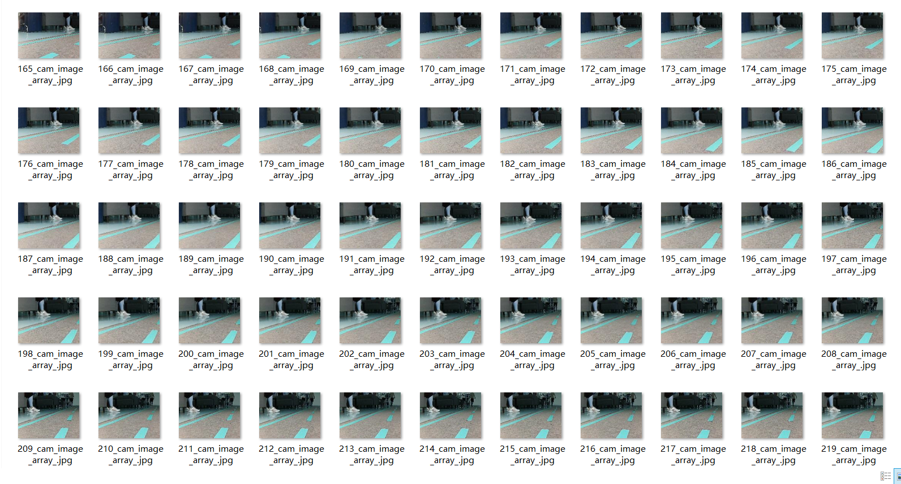
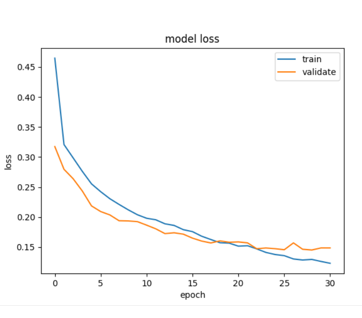
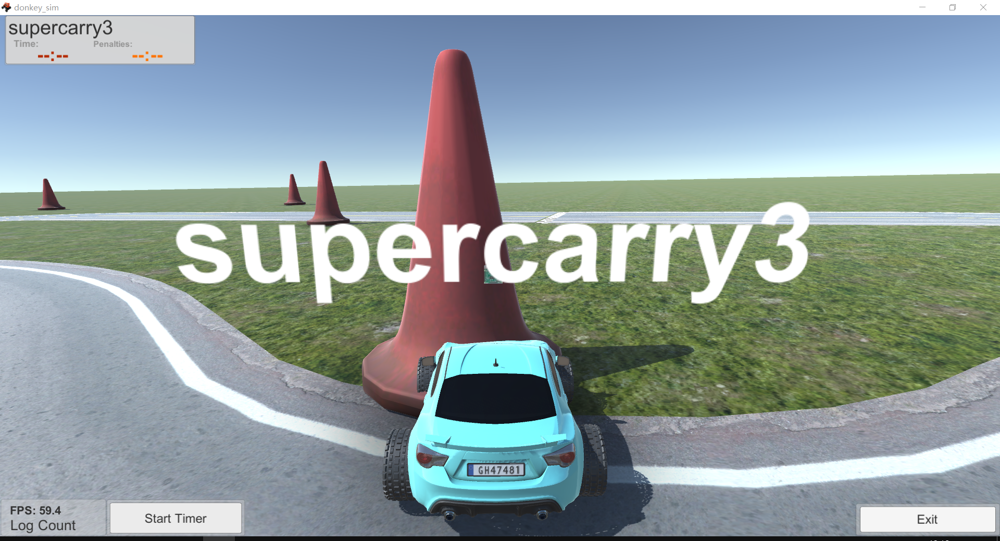
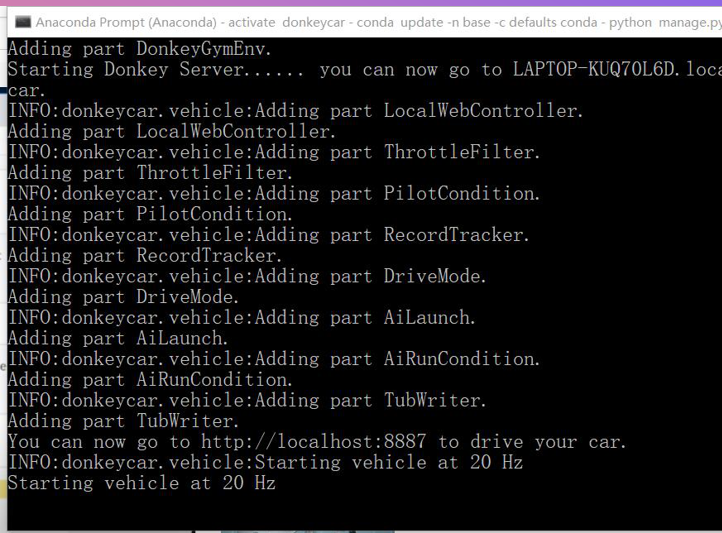

# swjtu-donkeycar  supercarry3

[TOC]

#### 介绍

人工智能donkeycar实习项目第三组的README.md文件

#### 小组成员及分工

##### 陈鑫海

- 小组汇报、数据采集、模型训练

##### 赵愚安

- 代码编写、模型训练、数据采集

##### 柴江波

- 小车搭建、文档撰写、数据采集

##### 周家杰

- 小车搭建、数据采集、文档撰写

##### 朱崇霖

-  小车搭建、数据采集、代码编写

#### 实习计划

| 日期 | 安排                           | 人员                   |
| ---- | ------------------------------ | ---------------------- |
| 12   | git下载、仓库搭建、撰写readme  | 全员                   |
| 13   | anaconda下载                   | 全员                   |
| 14   | 阅读donkey文档准备设计方案     | 全员                   |
| 15   | donkey模拟器实操、金工实习介绍 | 全员                   |
| 16   | PCB制造                        | 全员                   |
| 17   | 激光切割、3D打印               | 全员                   |
| 18   | donkeycar库学习及代码研究      | 全员                   |
| 19   | 环境配置                       | 全员                   |
| 20   | 小车组装                       | 柴江波、周家杰         |
| 21   | 采集数据                       | 陈鑫海、柴江波         |
| 22   | 小车训练                       | 赵愚安                 |
| 23   | 无人驾驶测试                   | 陈鑫海、周家杰、朱崇霖 |
| 24   | 调试优化                       | 陈鑫海、周家杰、朱崇霖 |
| 25   | 总结                           | 全员                   |


#### 仓库目录结构

```
.
├── data
│   ├── imags
│   ├── catalog.catalog
│   ├── catalog_0.catalog_manifest
|   ├──manifest.json
├── 工作日志 # 存放工作日志
│   ├── 陈鑫海.md
│   ├── 赵愚安.md
│   ├── 柴江波.md
│   └── 周家杰.md
│   └── 朱崇霖.md
├── docs #相关文件
│   ├── 模拟器配置及使用.md 
│   ├── day2.pptx(12日进度汇报)
│   ├── day3&4.pptx(13及14日进度汇报)
├── logs
├── README.md
├── models# 存放训练好的模型
│   ├── mypilot.h5
│   ├── database.json
│   ├── mypilot.png
└── testcar # DonkeyCar项目目录
    ├── calibrate.py
    ├── config.py
    ├── logs
    ├── manage.py
    ├── myconfig.py
    ├── train.py
    └── unitylog.txt
```


#### 实习过程相关图片








